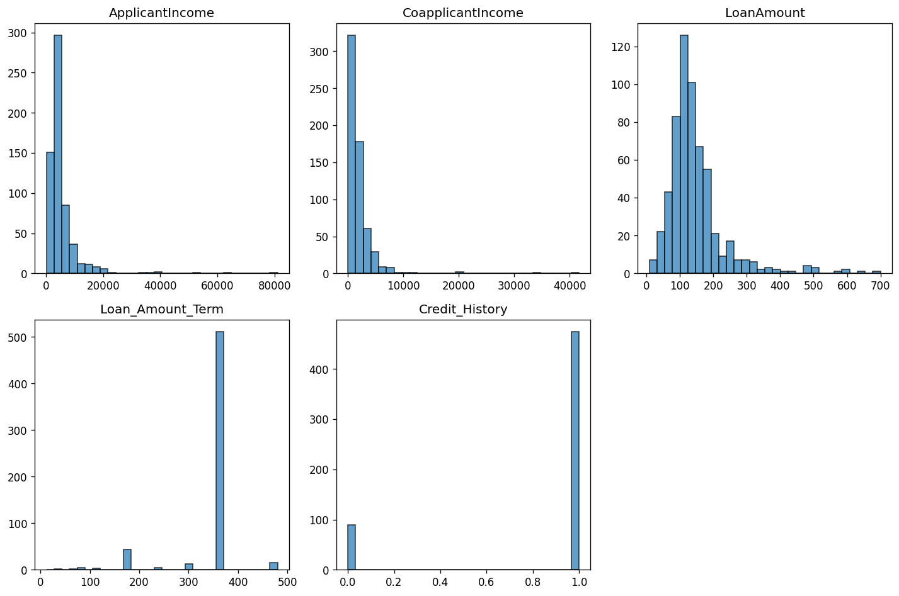
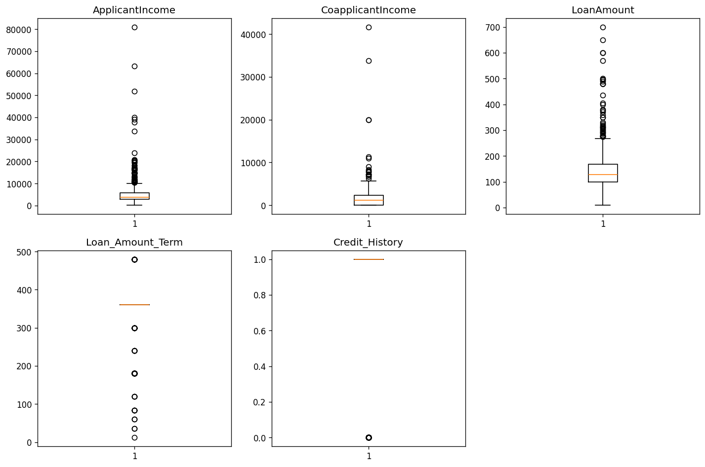
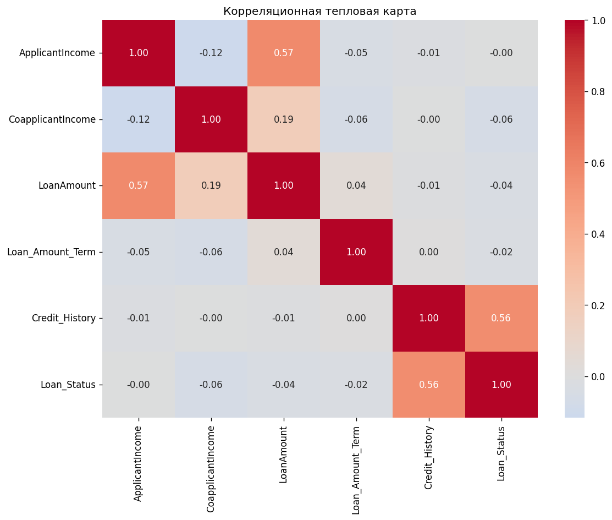
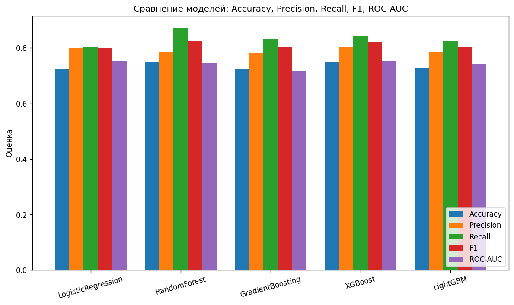
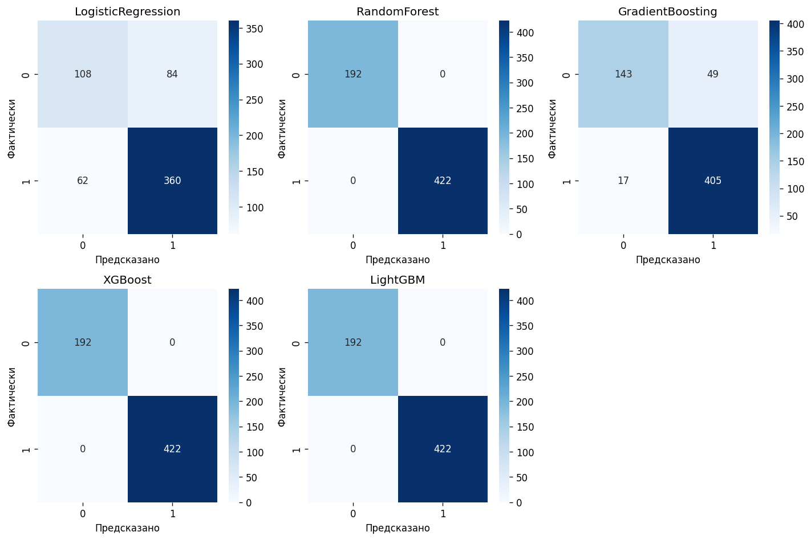
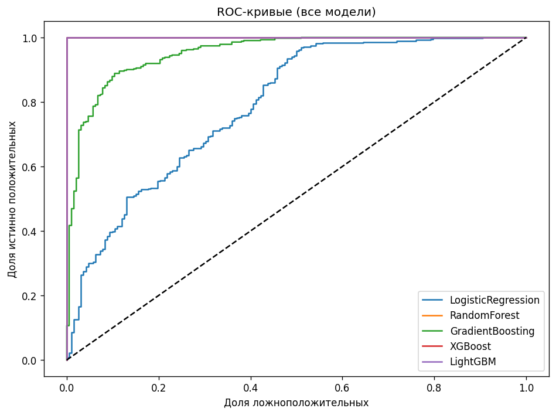
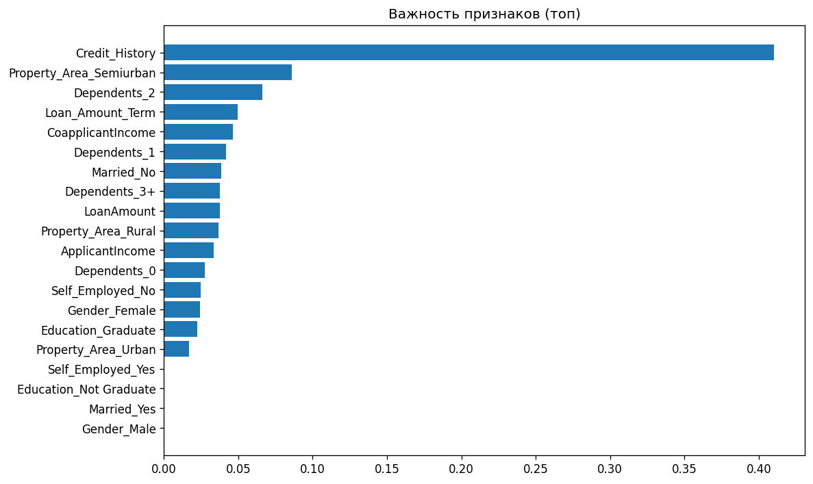

# Система прогноза одобрения займа

Проект предсказывает, одобрит ли банк заявку (`Loan_Status`: `Y/N`) по анкете клиента.  
Это учебный end-to-end сценарий: загрузка данных, EDA, обучение нескольких моделей, выбор лучшей, CLI и GUI для прогноза.

## Что умеет проект

- делает базовый EDA: пропуски, распределения, выбросы;
- строит пайплайн препроцессинга: импутация, масштабирование, one-hot кодирование;
- обучает 5 моделей и сравнивает их через кросс-валидацию;
- подбирает гиперпараметры для двух лучших моделей через `GridSearchCV`;
- сохраняет артефакты в `models/` и графики в `output/`;
- умеет делать прогноз в интерактивном режиме, по одной строке и по CSV;
- содержит web GUI на Streamlit для одиночного и пакетного прогноза.

## Быстрый старт

Установить зависимости:

```bash
pip install -r requirements.txt
```

Обучить модели и сохранить метрики:

```bash
python pipeline.py
```

После этого можно запускать прогнозы.

Интерактивный режим:

```bash
python predict.py
```

Одна заявка строкой:

```bash
python predict.py --row "5000,0,120,360,1,Male,Yes,0,Graduate,No,Urban"
```

Пакетный прогноз:

```bash
python predict.py --csv archive/loan_sanction_test.csv
```

Файл результата появится рядом с входным CSV и будет называться `{имя_файла}_predictions.csv`.

GUI (Streamlit):

```bash
python -m streamlit run app.py
```

В GUI есть три вкладки:
- одиночный прогноз по форме;
- пакетный прогноз по загруженному CSV;
- просмотр графиков из `output/`.

## Как читать графики из `output/`

### 1) Сначала смотрим на данные

#### `eda_histograms.png`
Что видно:
- в train 614 заявок;
- классы несбалансированы: `Y=422` (68.7%), `N=192` (31.3%);
- числовые признаки: `ApplicantIncome`, `CoapplicantIncome`, `LoanAmount`, `Loan_Amount_Term`, `Credit_History`.

Какие выводы делать:
- сильный дисбаланс классов объясняет, почему в коде включается `RandomOverSampler`;
- по распределениям доходов и суммы кредита видно, что данные не "идеально нормальные", значит линейная модель без аккуратного препроцессинга обычно проигрывает бустингам.



#### `eda_boxplots.png`
Что видно (по IQR-правилу в коде):
- `ApplicantIncome`: 50 выбросов;
- `CoapplicantIncome`: 18;
- `LoanAmount`: 39;
- `Loan_Amount_Term`: 88;
- `Credit_History`: 89.

Какие выводы делать:
- выбросов много, особенно в `Loan_Amount_Term` и `Credit_History`, поэтому импутация и масштабирование в пайплайне действительно нужны;
- на таких данных деревья/бустинги часто устойчивее к "тяжелым хвостам", чем голая линейная модель.



#### `eda_correlation_heatmap.png`
Что видно:
- самая заметная связь с таргетом у `Credit_History` (`corr ≈ +0.562`);
- остальные числовые признаки по отдельности слабо коррелируют с таргетом (около нуля по модулю: от `-0.059` до `-0.005`).

Какие выводы делать:
- кредитная история - главный одиночный сигнал;
- высокая точность без учета `Credit_History` маловероятна, а итоговое качество чаще будет строиться на комбинации признаков, а не на одном доходе/сроке.



### 2) Дальше сравниваем модели

#### `model_comparison_barchart.png` (кросс-валидация)
Что видно по средним CV-метрикам:
- `XGBoost`: `Accuracy=0.749`, `Recall=0.844`, `ROC-AUC=0.753`;
- `LogisticRegression`: `Accuracy=0.725`, `Recall=0.801`, `ROC-AUC=0.753`;
- `RandomForest`: `Accuracy=0.749`, `Recall=0.872`, `ROC-AUC=0.745`;
- `LightGBM`: `Accuracy=0.726`, `Recall=0.827`, `ROC-AUC=0.741`;
- `GradientBoosting`: `Accuracy=0.723`, `Recall=0.832`, `ROC-AUC=0.716`.

Какие выводы делать:
- по `ROC-AUC` лидируют `XGBoost` и `LogisticRegression`, поэтому именно они логично идут в `GridSearchCV`;
- `RandomForest` дает самый высокий `Recall`, но у него хуже `ROC-AUC`, то есть он лучше вылавливает одобрения, но хуже ранжирует заявки в целом.



### 3) Потом проверяем характер ошибок

#### `confusion_matrices.png` (train-оценка, не hold-out)
Что видно:
- `LogisticRegression`: `TN=108, FP=84, FN=62, TP=360`;
- `GradientBoosting`: `TN=143, FP=49, FN=17, TP=405`;
- `RandomForest`, `XGBoost`, `LightGBM`: идеальные матрицы `[[192, 0], [0, 422]]` на train.

Как читать ошибки и цену ошибки:
- `FP` - для банка это прямой кредитный риск и потенциальные потери.
- `FN` - это упущенная прибыль и ухудшение клиентского опыта.
- в кредитном скоринге чаще дороже `FP`, но точная цена зависит от бизнес-политики, резервов и стоимости фондирования.

Какие выводы делать:
- идеальные train-матрицы у бустингов и леса - признак переобучения на обучающей выборке.



#### `roc_curves_all.png` (train-оценка)
Что видно по train AUC:
- `XGBoost=1.00`, `LightGBM=1.00`, `RandomForest≈1.00`, `GradientBoosting=0.953`, `LogisticRegression=0.791`.

Смысл ROC-кривых:
- ROC показывает компромисс между `TPR` и `FPR` при разных порогах;
- выбор порога позволяет регулировать баланс между `FP` и `FN`.



### 4) В конце разбираем интерпретацию

#### `feature_importance.png`
Что видно (финальная модель после прогона - `XGBClassifier`):
- самый важный признак: `Credit_History` (`importance ≈ 0.410`);
- заметные дальше: `Property_Area_Semiurban` (`0.086`), `Dependents_2` (`0.066`), `Loan_Amount_Term` (`0.050`), `CoapplicantIncome` (`0.046`), далее категориальные с меньшим вкладом.

Какие выводы делать:
- модель в первую очередь опирается на кредитную историю, что согласуется с корреляционным анализом;
- важности из бустинга не равны причинности: это вклад в предсказание на конкретном датасете, возможное переобучение.



## Технологии

- Данные: `pandas`, `numpy`
- Модели: `scikit-learn`, `xgboost`, `lightgbm`
- Препроцессинг: `ColumnTransformer`, `Pipeline`, `RandomOverSampler`
- Метрики и CV: `StratifiedKFold`, `cross_validate`, `GridSearchCV`
- Визуализация: `matplotlib`, `seaborn`
- GUI: `streamlit`
- Сохранение артефактов: `joblib`

## Данные

Используется датасет Kaggle Loan Prediction / Home Loan Approval:
- `archive/loan_sanction_train.csv`
- `archive/loan_sanction_test.csv`

## Структура

`config.py` - пути и константы.  
`inference.py` - общий слой инференса для CLI и GUI.  
`pipeline.py` - обучение, оценка, графики.  
`predict.py` - CLI для прогнозов.  
`app.py` - Streamlit GUI.  
`archive/` - входные данные.  
`output/` - графики (появляются после обучения).  
`models/` - сохраненные артефакты модели.
